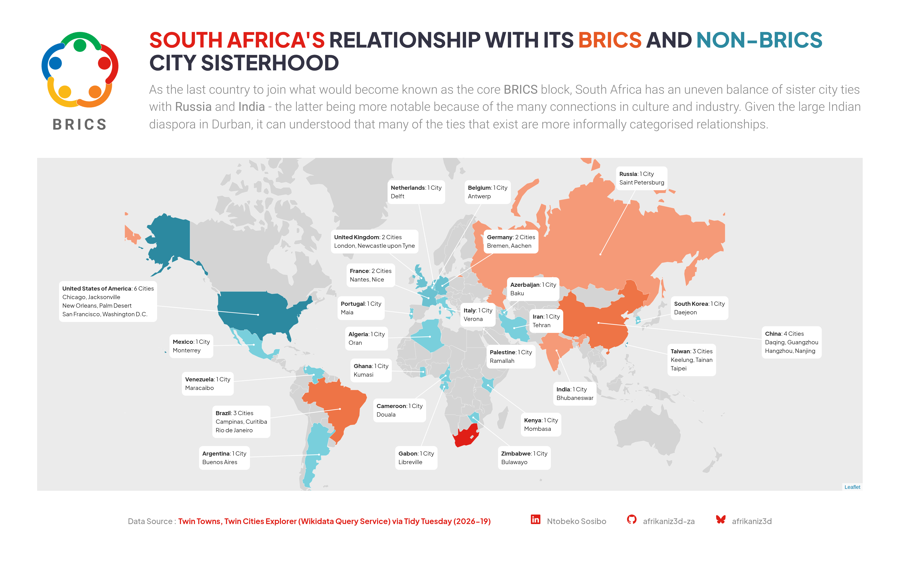
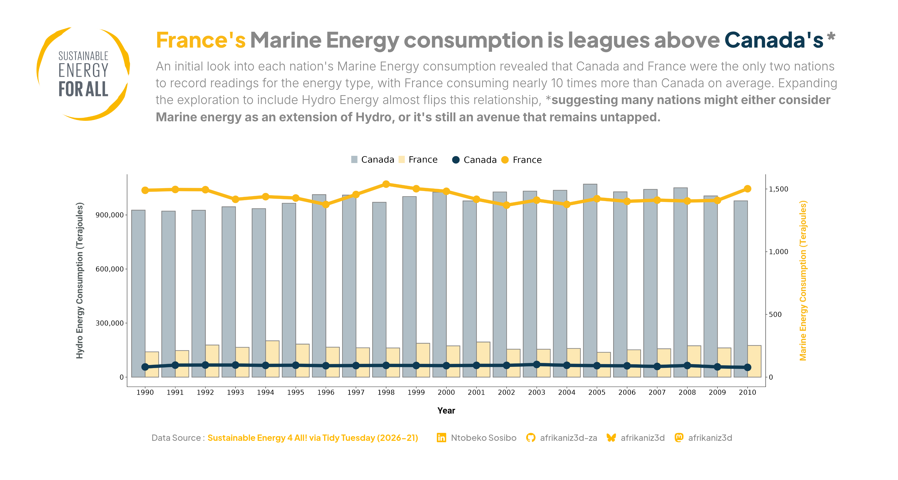

## Tidy Tuesday
### Collection of Past Perticipations  

### Project List:

- TT-2024-12: [X-Men Mutant Moneyball](https://github.com/afrikaniz3d-za/Tidy-Tuesday-Participation/tree/main/tt_2024_12)
- TT-2025-32: [Climate Events in Sub-Saharan Africa](https://github.com/afrikaniz3d-za/Tidy-Tuesday-Participation/tree/main/tt_2025_32)  

TT-2026-13: [Coastal Ocean Temperature by Depth](https://github.com/afrikaniz3d-za/Tidy-Tuesday-Participation/tree/main/tt_2026_13)
  

&nbsp;  

TT-2026-14: [Bird Sightings at Sea](https://github.com/afrikaniz3d-za/Tidy-Tuesday-Participation/tree/main/tt_2026_15)
  

&nbsp;

TT-2026-18: [Italian Industrial Production](https://github.com/afrikaniz3d-za/Tidy-Tuesday-Participation/tree/main/tt_2026_19)
.png)  

&nbsp;

TT-2026-19: [Twinned Towns](https://github.com/rfordatascience/tidytuesday/tree/main/data/2026/2026-05-12)
  

&nbsp;

TT-2026-20: [State of Crossref metadata by member country](https://github.com/rfordatascience/tidytuesday/tree/main/data/2026/2026-05-19)  
  

&nbsp;

TT-2026-21: [Sustainable Energy 4 All!](https://github.com/rfordatascience/tidytuesday/tree/main/data/2026/2026-05-26)  
  

&nbsp;

TT-2026-22: [European Parental Leave Policies](https://github.com/rfordatascience/tidytuesday/tree/main/data/2026/2026-06-02)  
  

&nbsp;
