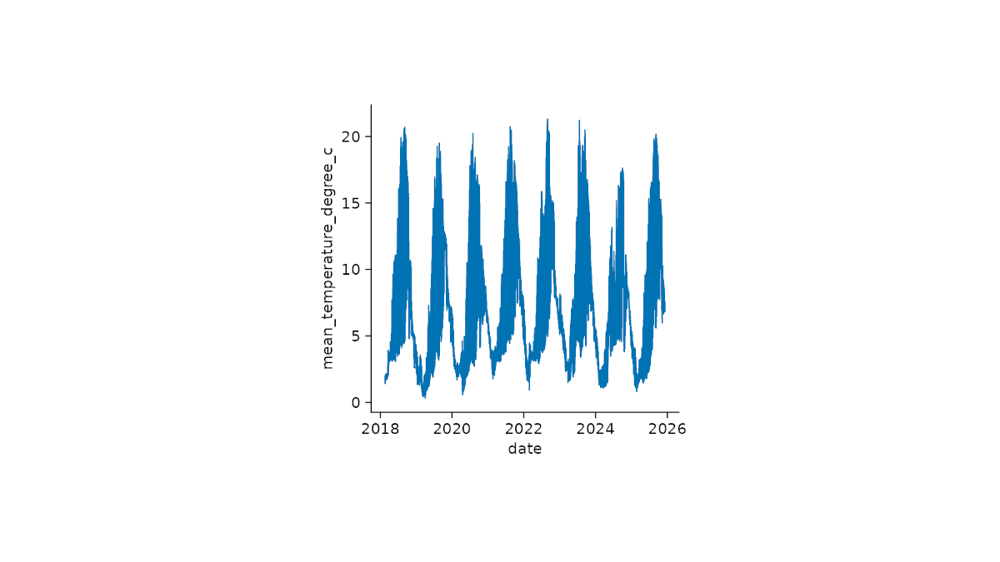
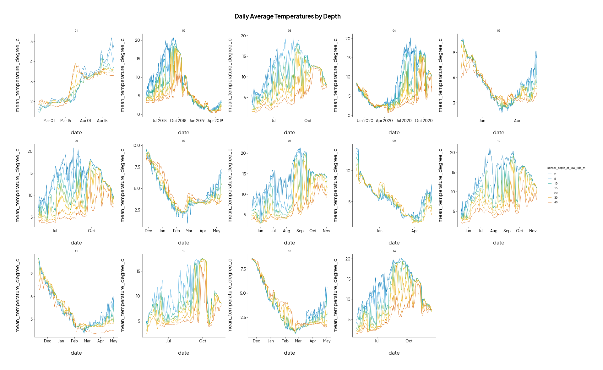
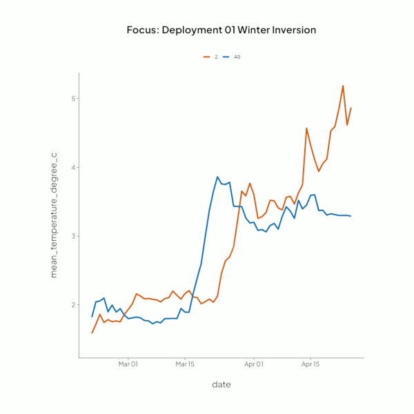
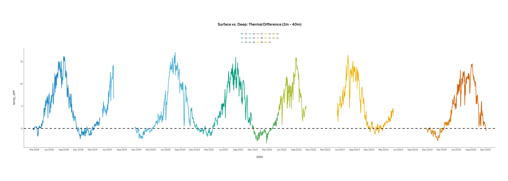
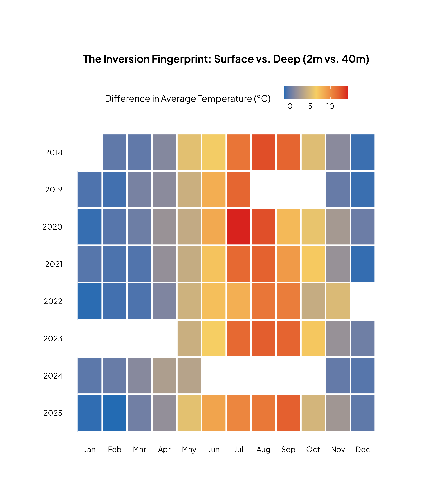

&nbsp;  

## Timeline confusion

  
  
I first made a Gantt-style chart using the `ocean_temperature_deployments` table to confirm the flush transitions. Nothing really stood out other than deployments `02` and `04` being longer than the others.  

&nbsp;

### Confusion with the deployment periods

After visualising the `ocean_temperature_deployments` table, I
moved to do the same with the main `ocean_temperature` table. I noticed
that there was no indication (in the table) of what deployment the sensor readings were
a part of, and that's when I realised I'd need to perform a join.

I usually perform this kind exploration and wrangling in SQL, so my
go-to method would be with `CASE` statements. In R, this would be with
the `case_when` function in `dplyr`. This is where I ran into the first
stump:

> **A deployment's `end_date` was also the `start_date` of the following
> deployment.**

My plan *was* to use a timestamp and time of day to decide if I was
dealing with sensor at the start, duration, or end of its deployment.
The cleaned table that was supplied only had the date info. This
prompted my looking through the cleaning script where I found the link
to the site hosting the data. On it I was able to browse the entire
dataset where I was able to find the pre-cleaned `timestamp_utc` column
that had the time data I needed, but I also found the `deployment_range`
column that would immediately make it clear on those threshold days
which side the observation belonged. With this new column I no longer
needed the time data, and I could keep joining simple.

### Re-Cleaning the data

To bring the column into `ocean_temperature`, I looked through the cleaning script where I founf the link to thedata portal. My hope was to dind the unedited timestamp data for each observation. The plan was to pull that column and then do some `case_when()'s` to attribute the deployment data to each row.  

I ended up finding a better option - the `deployment_range` column that did no longer needed extra steps to define a simplified deployment column.  

``` r

library(data.table)
library(dplyr)
library(here)
library(lubridate)
library(tidyr)

# downloaded manually to tt_submission/Lunenburg_County_Water_Quality_Data_20260312.csv from
# https://data.novascotia.ca/Nature-and-Environment/Lunenburg-County-Water-Quality-Data/eda5-aubu/explore/query/SELECT%0A%20%20%60waterbody%60%2C%0A%20%20%60station%60%2C%0A%20%20%60lease%60%2C%0A%20%20%60latitude%60%2C%0A%20%20%60longitude%60%2C%0A%20%20%60deployment_range%60%2C%0A%20%20%60string_configuration%60%2C%0A%20%20%60sensor_type%60%2C%0A%20%20%60sensor_serial_number%60%2C%0A%20%20%60timestamp_utc%60%2C%0A%20%20%60sensor_depth_at_low_tide_m%60%2C%0A%20%20%60depth_crosscheck_flag%60%2C%0A%20%20%60dissolved_oxygen_percent_saturation%60%2C%0A%20%20%60dissolved_oxygen_uncorrected_mg_per_l%60%2C%0A%20%20%60salinity_psu%60%2C%0A%20%20%60sensor_depth_measured_m%60%2C%0A%20%20%60temperature_degree_c%60%2C%0A%20%20%60qc_flag_dissolved_oxygen_percent_saturation%60%2C%0A%20%20%60qc_flag_dissolved_oxygen_uncorrected_mg_per_l%60%2C%0A%20%20%60qc_flag_salinity_psu%60%2C%0A%20%20%60qc_flag_sensor_depth_measured_m%60%2C%0A%20%20%60qc_flag_temperature_degree_c%60%0AWHERE%20caseless_one_of%28%60station%60%2C%20%22Birchy%20Head%22%29/page/filter      # <1>
# this is a large file: 385 MB
# it is ~2x faster to import using data.table::fread compared to readr::read_csv
dat_all <- data.table::fread(
  here("datapack/tt_submission/Lunenburg_County_Water_Quality_Data_20260325.csv"),
  data.table = FALSE,
  na.strings = c("NA", "")
)

# note on qc_flag_* columns -----------------------------------------------

# The qc_flag_** columns are quality control flags for each variable.
# Possible values are:
## Pass: observation passed all QC tests.
## Not Evaluated: observation could not be evaluated by at least one test.
## Suspect/Of Interest: observation is either poor quality or part of an unusual 
### event. In this dataset, most Suspect/Of Interest temperature measurements 
### are considered "Of Interest" and may be included in analyses.
## Fail: observation failed at least one QC test and should not be included in
### most analyses.

# temperature dataset -----------------------------------------------------

# filter to exclude observations that failed QC tests
# calculate daily average temperature to reduce size of the csv file to 537 kb
ocean_temperature <- dat_all %>% 
  dplyr::filter(
    station == "Birchy Head",
    !(is.na(temperature_degree_c) & qc_flag_temperature_degree_c == ""),
    qc_flag_temperature_degree_c != "Fail"
  ) %>% 
  dplyr::mutate(date = lubridate::as_date(timestamp_utc)) %>% 
  
  # Add deployment_range to the group, getting it through the summarise bottleneck
  group_by(date, sensor_depth_at_low_tide_m, deployment_range) %>%    # <2>
  summarise(
    mean_temperature_degree_c = mean(temperature_degree_c),
    sd_temperature_degree_c = sd(temperature_degree_c),
    n_obs = n(),
    .groups = "drop" # Modern way to ungroup automatically
  )
  
```

1.  The link to the data full dataset.
2.  Adding the `deployment_range` column inside the `group_by()`
    statement so that it's part of the table, but doesn't get involved
    in the aggregating.

That's all I needed to change in the cleaning script. After downloading
the big file of the full data set and putting it in the prescribed
location, I ran the script and generated the new `ocean_temperature_2`
table that now includes the `deployment range` column.

&nbsp; 

&nbsp;  

## Finding a hook  



After getting a clearer demarcation of which deployment each measurement
belonged in, I moved to start visualising them see if anything stood
out. I made a variety of configurations - daily mean temperatures on
single large plot where I saw a wave pattern, to a grid of plots faceted
by year or deployment.

&nbsp;


The facet chart above is where I noticed an inversion in the mean temperature between readings taken at the **2m** (dark blue) and **40m** (red) depths. This was my hook.  

I did a quick Google search - which is basically free Gemini* - and this is where I learned about the [Labrador Current](https://en.wikipedia.org/wiki/Labrador_Current).  

&nbsp;  

  
  
These charts made it clear that there was an inversion of mean temperatures between the 2m and 40m depths from December to the beginning of April. 

Having decided this is what I wanted to highlight for my submission, I wanted to prepare a table that I could use to generate a secondary visual that also visualised the intersection and "flipping" of the temperatures between the depths during the highlighted period.  

&nbsp;  



You'll notice the these new gaps in the once continuous thread. Those are the result of a condition I added in the code to ensure I was only working with rows where all sensors were present. I looked through the data and found chunks where the data wasn't there. Rather than imputing, I chose to leave it as it is and ensure to visualise the blank space for transparency.  

&nbsp;  

## Presenting the findings  

  

I originally planned used tidyplots in the final presentation, but kept running into issues getting the object to play nice with my html template, so I opted use `echarts4r` . The great thing about this package is that it's interactive by default, so it allows the viewer some engagement.  

At the bottom of this page is what generates the final presentation. I commented-out the lines dealing with the actual exporting of the high resolution image. Becaue `echarts4r` is interactive, coupled with the presentation being housed in html, the presentation is interactive - try changing the size of the window <--  -->    

&nbsp;

## Final thoughts  

Going into this project, knowing very little about ocean studies, made this a purely explore-and-discover exercise. Noticing that "flip" locked it in  and made it the keystone for the rest of the project, making it easy to decide the next move.  

I also got to wrangle some hmtl to round things out, and I'm really happy with the final result.  

&nbsp;

&nbsp;  


```{r}
#| code-fold: true
#| label: ocean-temp
#| fig-width: 12
#| fig-height: 17
#| echo: true
#| eval: true
#| message: true
#| warning: false

suppressPackageStartupMessages({
  library(readr)
  library(dplyr)
  library(tidyr)
  library(stringr)
  library(echarts4r)
  library(forcats)
  library(htmltools)
  library(htmlwidgets)
#  library(webshot2) for exporting the presentation panel as a high resolution image
  })
  
# bringing in the data data
heatmap_data <- read.csv("data/heatmap_data.csv")
profile_viz_data <- read.csv("data/profile_viz_data.csv")

# generating the heatmap chart
heatmap_output <- heatmap_data |> 
  e_charts(
    month,
    height = 500
    ) |> 
  e_heatmap(
    year, 
    avg_gap,
    itemStyle = list(
      borderColor = "#ffffff", 
      borderWidth = 3         
      )
    ) |> 
  e_visual_map(
    avg_gap,
    orient = "horizontal",
    left = "center",
    top = 15,
    calculable = TRUE,
    # blue for inversion (negative), White for mid, red for summer (positive)
    inRange = list(color = c("#236bb3", "#f6ce63", "#d7191c")),
    min = min(heatmap_data$avg_gap, na.rm = TRUE),
    max = max(heatmap_data$avg_gap, na.rm = TRUE),
    # ensuring the 'honesty gaps' are explicitly white
    outOfRange = list(color = "#ffffff"),
    name = "Difference in Average Temperature (°C)",
    text = list("Warmer Surface", "Inversion (Deep Warmer)"), 
    textStyle = list(fontFamily = "Plus Jakarta Sans", fontSize = 16, color = "#888")
  ) |>

  e_y_axis(
    show = TRUE,
    inverse = FALSE, 
    axisLabel = list(
    margin = 20, 
    fontFamily = "Plus Jakarta Sans",
    fontSize = 16
  ),
    axisLine = list(show = FALSE),
    axisTick = list(show = FALSE)
  ) |>
  e_x_axis(
    show = TRUE,
    nameLocation = "middle",
    nameGap = 150,
    axisLabel = list(
    margin = 20, 
    fontFamily = "Plus Jakarta Sans",
    fontSize = 16
    ),
    axisLine = list(show = FALSE),
    axisTick = list(show = FALSE)
  ) |>
  
  e_tooltip() |>
  e_legend(
    show = FALSE
    ) |>

  e_grid(
    top = "15%")


  # presentation base container (this is the canvass)
  # final_viz <- 
  htmltools::tagList(
  tags$div(
    style = "

      background-color: white;
      padding: 50px;
      margin-left: 50px;
      margin-right: 50px;
      margin-bottom: 20px;
      ",
    
  # nova scotia logo
  tags$img(
    src = "graphic_design/ns_logo.png",     
    width = "auto",             
    height = "80px",
    style = "margin-bottom: 15px;"
    ), 

  # title rich text
  tags$div(
      style = "text-align:left; margin-bottom: 15px; font-family: Plus Jakarta Sans;",
      HTML(
        "<span style='color:#334; font-size:44px; font-weight:bold;'>WINTER </span> <span style='color:#236bb3; font-size:44px; font-weight:bold;'> LABRADOR </span> <span style='color:#334; font-size:44px; font-weight:bold;'> CURRENT INVERSIONS CONTRAST WITH </span> <span style='color:#d7191c; font-size:44px; font-weight:bold;'> SUMMER </span> <span style='color:#334; font-size:44px; font-weight:bold;'> SURFACE WARMING </span>"
      )
    ),
    
    # subtitle rich text
    tags$div(
      style = "text-align:left; font-family: roboto; font-size:32px;font-weight: 300; color:#888; line-height:1.4; margin-bottom:30px;",
      HTML(
        "While typical years show uniform surface warming, the <b>2022</b>–<b>2023</b>. Arctic pulse suppressed overall temperatures and triggered a unique <b>thermal inversion</b>. The '<b>X</b>' in the vertical profile (right) marks the <b>isothermal pivot</b>, the exact moment and depth where buoyant, sub-zero inflow from the <b>Labrador Current</b> caps the surface, effectively turning the water column's physical signature upside down."
      )
    ),


# responsive flexbox that holds both charts
tags$div(
  style = "
    display: flex; 
    flex-wrap: wrap; 
    gap: 20px; 
    align-items: flex-start; 
    width: 100%;
  ",
  
  # heatmap wrapper
  tags$div(
    style = "
      flex: 2; 
      min-width: 500px; 
      display: flex; 
      flex-direction: column;
    ",
    
    # heatmacp chart title + legend heading
    tags$div(
      "Surface vs. Bottom Temperature Delta (°C)",
      style = "font-family: 'Plus Jakarta Sans'; font-size: 18px; font-weight: bold; color: #334; text-align: center; margin-bottom: 10px;"
    ),
    
    # heatmap chart placeholder (you could have put the complete code here too, like the line chart)
    heatmap_output
  ), # end of heatmap wrapper
  
  # vertical temperature profile line chart wrapper
  tags$div(
    style = "
      flex: 1; 
      min-width: 450px; 
      display: flex; 
      flex-direction: column; 
      padding-left: 20px;
    ",
    
    # chart + legend title
    tags$div(
      "Vertical Temperature Profile (°C)",
      style = "font-family: 'Plus Jakarta Sans'; font-size: 18px; font-weight: bold; color: #334; text-align: center; margin-bottom: 10px;"
    ),
    
    # generating vertical temperature profile line chart
    profile_viz_data |>
      group_by(month_label) |>
      e_charts(depth, height = 500) |>
      e_line(temp, smooth = TRUE, symbol = "circle", symbolSize = 10, lineStyle = list(width = 5)) |> 
      e_flip_coords() |>
      e_y_axis(
        inverse = TRUE, 
        name = "Depth (m)",
        nameTextStyle= list(
          fontSize = 18
          ),
        axisLabel = list(
          margin = 20, 
            fontFamily = "Plus Jakarta Sans",
            fontSize = 16
            ),
        axisLine = list(show = FALSE)
        ) |>
      e_x_axis(
        name = "Temp (°C)", 
        nameTextStyle= list(
          fontSize = 18
          ),
        axisLabel = list(
          margin = 20, 
            fontFamily = "Plus Jakarta Sans",
            fontSize = 16
            ),
        position = "top", 
        min =1, max = 5,
        axisLabel = list(
          margin = 20, 
            fontFamily = "Plus Jakarta Sans",
            fontSize = 16
            ),
        axisLine = list(show = FALSE),
        ) |>
      e_color(c("#236bb3", "#d7191c")) |> 
      e_legend(bottom = 5) |>
      e_tooltip(trigger = "item") |>
      e_grid(
        right = "25%")
  ) # closing vertical temperature profile line chart wrapper
), # closing responsive flexbox that holds both charts


# start of page footer with data and author details
tags$div(
      style = "text-align: center; margin-top: 50px; margin-bottom: 10px;",
    

  tags$span(
    "Data Source :",
    style = "color: #888; text-decoration: none; font-family: Plus Jakarta Sans; font-weight: 450;"),

  # tidy tuesday repo link
  tags$a(
    "Nova Scotia Data Portal via Tidy Tuesday (2026-13)",
    href = "https://github.com/rfordatascience/tidytuesday/tree/main/data/2026/2026-03-31",
    target = "_blank",
    style = "color: #236bb3; text-decoration: none; font-family: Plus Jakarta Sans; font-weight: bold;"
    ),

  HTML("&nbsp; &nbsp; &nbsp; &nbsp; &nbsp; &nbsp; &nbsp; &nbsp; &nbsp; &nbsp;"),

  # linkedin logo
  tags$img(
    src = "graphic_design/linkedin.svg",
    height = "20px",
    style = "filter: invert(31%) sepia(94%) saturate(1148%) hue-rotate(189deg) brightness(91%) contrast(92%); margin-right: 10px; vertical-align: middle;"
    ), 

  # linkedin link
  tags$a(
    "  Ntobeko Sosibo  ",
    href = "https://www.linkedin.com/in/ntobeko-sosibo/",
    target = "_blank",
    style = "color: #888; text-decoration: none; font-family: Plus Jakarta Sans; font-weight: 450;"
    ),
  
  HTML("&nbsp; &nbsp; &nbsp; &nbsp; &nbsp;"),

  # github logo
  tags$img(
    src = "graphic_design/github.svg",
    height = "20px",
    style = "filter: invert(31%) sepia(94%) saturate(1148%) hue-rotate(189deg) brightness(91%) contrast(92%); margin-right: 10px; vertical-align: middle;"
    ),
  
  # github link
  tags$a(
    "afrikaniz3d-za",
    href = "https://github.com/afrikaniz3d-za",
    target = "_blank",
    style = "color: #888; text-decoration: none; font-family: Plus Jakarta Sans; font-weight: 450;"
    ),
  
  HTML("&nbsp; &nbsp; &nbsp; &nbsp; &nbsp;"), 

  # bluesky logo
  tags$img(
    src = "graphic_design/bluesky.svg",
    height = "20px",
    style = "filter: invert(31%) sepia(94%) saturate(1148%) hue-rotate(189deg) brightness(91%) contrast(92%); margin-right: 10px; vertical-align: middle;"
    ),

  # bluesky link
  tags$a(
    "afrikaniz3d",
    href = "https://bsky.app/profile/afrikaniz3d.bsky.social",
    target = "_blank",
    style = "color: #888; text-decoration: none; font-family: Plus Jakarta Sans; font-weight: 450;"
    )
  ) # closing page footer with data and author details
)
)

#------------------------------------------------------
# exporting the presentation as a high resolution image
#------------------------------------------------------
  
# writing the html file directly to the project folder
# htmltools::save_html(final_viz, "temp_viz_render.html")


# webshot "takes" a picture of the html file, saving it in the same directory
#webshot2::webshot(
#  url = "temp_viz_render.html",
#  file = "Winter_Labrador_Inversion_Final.png",
#  vwidth = 1920,   # Wide enough to keep the side-by-side layout
#  vheight = 1080,  # Tall enough to avoid cutting off the footer
#  delay = 4,       # extra second for any animations to complete playing
#  zoom = 2         # double pixel density for sharpness
#)
```

