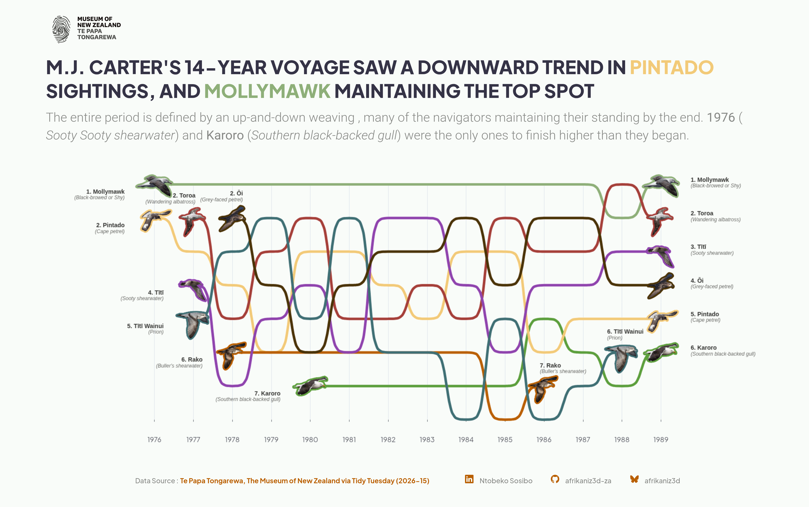
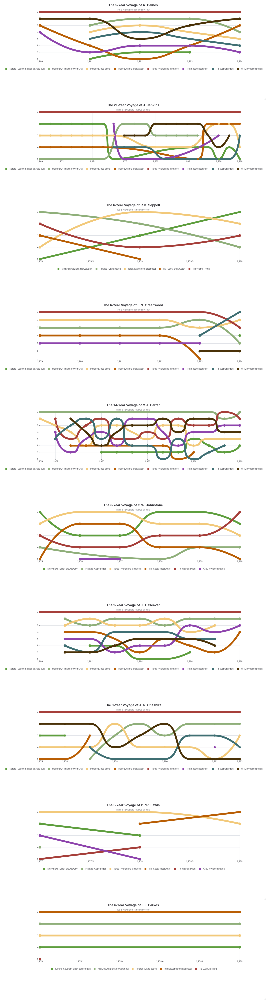
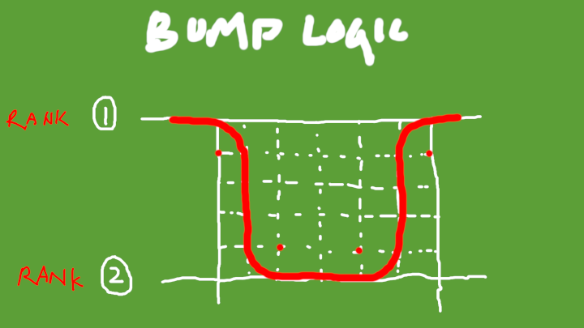
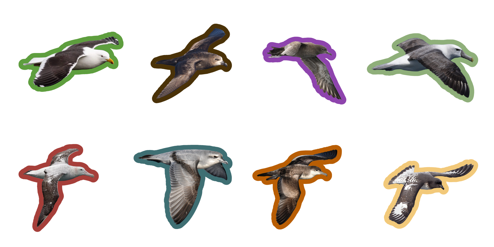

&nbsp;

&nbsp;  

## Choosing a direction before filtering down  

There was a lot of data to go through, so the first thing I did was look at both the `ships` and the `birds` tables` columns and think about what sorts of things could be interesting to look into:  

### The `ships` table  

* `cloud_cover` 
  * what were the most/least common?
* `observer`
  * observations unique to them
  * the species they are most associated with 


* `season`
  * how the species/observer changes over time

&nbsp;

### The `birds` table  

* `flying_past` / `following_ship` 
  * common species to follow ships/observer, rain or shine (`cloud_cover`, `precipitation`, `ships$season`
  * species that avoid ships altogether  
* `species_common_name` + `species_scientific_name` + TBD(names according to traditional roles) 
  * used in the 'culturifying' of the lists
* `count` can speak to the magnitude and assist in rankings
  * `n_flying_past`, `n_accompanying`, and `n_following_ship` can speak to the relationship of direct/proximity  
  
&nbsp;  

Because of time contstraints, I had to scale back a few things in terms of scope and depth, so I simplified the exploration to ranking the volume of sightings of just the navigator birds.  

&nbsp;

&nbsp;

## Cleaning the names  

There were a few cases where additional species/type for the same bird were recorded because of capitalisation, or mispelling, and something else I descovered during the clean-up process is that some birds went by different names. Consolidating them to one common name, along with finding their native Māori name, ended up being the most time-intensive task, but it was worth it because I think it made the project more authentic - and I got to learn and see so much.  

```r
# creating a second, simplified version of the observations table for easier aggregations
observations_simplified <- observations |>
  mutate(
    across(
      c(species_scientific_name, species_common_name), 
      ~str_remove_all(., " AD| AD DRK| AD LIGHT| DRK| IMM| JUV| LGHT| SUBAD| SUBAD DRK| SUBAD LGHT| WHITE| LIGHT| PL1| PL2| PL3| PL4| PL5| PL6| INT|$F|$M|M\\b|F\\b")
    )
  ) |>
  mutate(
    across(
      c(species_scientific_name, species_common_name), str_trim # extra level of clean-up
    )
  )

# clean-up needed
# "Cokk's / Pycroft's petrel" is a misspelling of Cook's / Pycrofts petrel. update before proceeding
# there were also a few cases where capitalisation (or lack-thereof) split into a different category
observations_final <- observations_simplified |>
  mutate(species_common_name = case_match(
    species_common_name,
    
    # spelling Fixes
    "Cokk's / Pycroft's petrel" ~ "Cook's / Pycroft's petrel",
    
    # albatross/mollymawk consolidations
    "Black-browed albatross sensu lato" ~ "Black-browed mollymawk",
    "Black-browed albatross"            ~ "Black-browed mollymawk",
    
    "Shy / white-capped / Salvin's /  Chatham mollymawk" ~ "Shy / White-capped mollymawk",
    "Yellow-nosed mollymawk sensu lato"                  ~ "Yellow-nosed mollymawk",
    
    # petrel merges
    "Great-winged / Grey-faced petrel" ~ "Grey-faced petrel",
    "Westland / White-chinned petrel"  ~ "Westland petrel",
    "Southern royal albatross"         ~ "Royal albatross",
    
    # case_match handles the fallback
    .default = species_common_name
    )
  )
# done  

cultural_mapping <- c(
  "Toroa (Wandering albatross)" = "Wandering albatross sensu lato",
  "Ōi (Grey-faced petrel)" = "Grey-faced petrel",
  "Tītī (Sooty shearwater)" = "Sooty shearwater",
  "Tītī Wainui (Prion)" = "Prion (unidentified)",
  "Pintado (Cape petrel)" = "Cape petrel",
  "Rako (Buller's shearwater)" = "Buller's shearwater",
  "Karoro (Southern black-backed gull)" = "Southern black-backed gull",
  "Mollymawk (Black-browed or Shy)" = "Black-browed mollymawk" 
```  

&nbsp;

&nbsp;  

## Visual inspiration  

Knowing I wanted to create a bump chart, and that `echarts4r` doesn't have a native `e_bump()` function, there was a need to figure it out. I wasn't a fan on the [ECharts](https://echarts.apache.org/examples/en/editor.html?c=bump-chart) example, so I image-searched and found Tanya Shapiro's [EPL](https://tanyaviz.com/projects/premier-league/) interactive chart.  

The controlled, consistent curves were very difficult to achieve, making this project a great opportunity to also figure out how to create `gg_bump`-style charts.  

&nbsp;

{#fig-bump-inspo width="60%" fig-align="center"}  

&nbsp;

{#fig-selection width="60%" fig-align="center"} 

I generated the charts above to see what could be considered usable, criteria being a chart where enough time passed to witness any trends or any other interesting relationship.  

&nbsp;
 
&nbsp;

### Creating a function to create a cleaner bump chart  

Something the out-of-the-box `echarts4r` tools couldn't do is create those uniform curves seen in the `gg_bump` examples. My solution developed in stages. I first looked at inputting a rank for every year to control/tighten the curves so that they looked more regular, but it still wan't looking as elegant. This is when I learned about the [Sigmoid Curve](https://en.wikipedia.org/wiki/Sigmoid_function) and it's function. I already had a mental image of what I wanted the curve behaviour to be, and it was additionaly helpful to now have the math of it all to begin developing a function to preprocess the tables.  



&nbsp; 

&nbsp;

## Making it more visual  

I googled high resolution images of the selection 8 birds, lasso'd them in GIMP, added a border coloured according to the palette I created using the museum's website as a reference, then exported them as PNGs with transparent backgrounds.  

{#fig-all8 width="80%" fig-align="center"}

Once these elements were sorted I could move to composing the panels (which are interactive, give them a hover-over) and making the necessary adjustments to keep things readable.  

&nbsp;

&nbsp;


```{r}
#| code-fold: true
#| label: cleaver-bird-sightings
#| fig-width: 12
#| fig-height: 17
#| echo: true
#| eval: true
#| message: true
#| warning: false

suppressPackageStartupMessages({
  library(readr)
  library(dplyr)
  library(tidyr)
  library(stringr)
  library(lubridate)
  library(echarts4r)
  library(base64enc)
  library(forcats)
  library(htmltools)
  library(htmlwidgets)
#  library(webshot2) # for exporting the presentation panel as a high resolution image
  })
  
# bringing in the data data
cleaver_finessed <- read.csv("data/cleaver_finessed.csv")
cleaver_bump_data <- read.csv("data/cleaver_bump_data.csv")

# introducing the colour palette
te_papa_colours <- c(
  "Toroa (Wandering albatross)" = "#5E9E3EFF",
  "Ōi (Grey-faced petrel)" = "#8FAF7AFF",
  "Tītī (Sooty shearwater)" = "#F2C97AFF",
  "Tītī Wainui (Prion)" = "#B95E04FF",
  "Pintado (Cape petrel)" = "#A63F3AFF",
  "Rako (Buller's shearwater)" = "#8E44ADFF",
  "Karoro (Southern black-backed gull)" = "#3F6F73FF",
  "Mollymawk (Black-browed or Shy)" = "#4A3208FF"
  )

# 1. preparing icon landing data
bird_landings <- cleaver_bump_data |>
  # create clean_name so the loop and strsplit have something to work with
  mutate(clean_name = as.character(display_name)) |> 
  group_by(display_name) |>
  filter(year == min(year) | year == max(year)) |>
  ungroup()

# creating lookup table
bird_bounds <- bird_landings |>
  group_by(display_name) |>
  summarise(
    start = min(year), 
    end = max(year), 
    .groups = "drop"
  )

# generating the bump chart
cleaver_final <- cleaver_finessed |> 
  group_by(display_name) |> 
  e_charts(year_fine, height = 700) |> 
  e_line(
    rank_fine, 
    smooth = TRUE, 
    symbol = "none", 
    lineStyle = list(
      width = 6
      ),
    emphasis = list(focus = "series")
    ) |> 
  e_x_axis(
    type = "value", 
    min = 1980, 
    max = 1988,
    interval = 1, 
    splitNumber = 8,
    axisLabel = list(
      margin = 20,
      fontFamily = "Plus Jakarta Sans",
      fontSize = 16,
      formatter = htmlwidgets::JS("function(value){ return value.toString(); }"), 
      hideOverlap = FALSE,       
      showMinLabel = TRUE,
      showMaxLabel = TRUE
      ),
    axisLine = list(
        show = FALSE
        ),
    splitLine = list(show = TRUE) 
    ) |> 
  e_y_axis(
    inverse = TRUE, 
    min = 1, max = 8,
    show = FALSE
    ) |> 
  e_grid(
    left = "15%",
    right = "15%"
    ) |>
  e_color(color = unname(te_papa_colours)) |> 
  e_tooltip(
    trigger = "axis",
    formatter = htmlwidgets::JS("
      function(params) {
        let val = params[0].value[0];
        if (val % 1 === 0) {
          let res = '<strong>Year: ' + val + '</strong><br/>';
          
          // Sort params based on the Y-axis value (rank)
          // Since inverse=TRUE, lower numbers are 'higher' rank
          params.sort((a, b) => a.value[1] - b.value[1]);
          
          params.forEach(p => {
            if(p.seriesType === 'line'){
              // Clean name to remove (Common Name) for the tooltip if preferred
              let shortName = p.seriesName.split(' (')[0];
              res += p.marker + shortName + ': Rank ' + Math.round(p.value[1]) + '<br/>';
            }
          });
          return res;
        }
        return null;
      }
    ")
  ) |>
  e_legend(show = FALSE)


# individualised control for the icon labels in case of overlap
label_adjustments <- list(
  # v_align sets the anchor, y sets the fine-tuned pixel nudge
  "Karoro (Southern black-backed gull)_start" = list(v_align = "middle", dist = -45, y = -36), # middle because it's not at the end
  "Karoro (Southern black-backed gull)_end" = list(v_align = "bottom", dist = 10, y = 40), 
  "Tītī Wainui (Prion)_start" = list(v_align = "top", dist = 20, y = 10),
  "Tītī Wainui (Prion)_end" = list(v_align = "bottom", dist = 55, y = 10),
  "Toroa (Wandering albatross)_start" = list(v_align = "top", dist = 20, y = 10),
  "Toroa (Wandering albatross)_end" = list(v_align = "bottom", dist = 20, y = 10),
  "Ōi (Grey-faced petrel)_start" = list(v_align = "top", dist = 20, y = 10),
  "Ōi (Grey-faced petrel)_end" = list(v_align = "bottom", dist = 46, y = 10),
  "Tītī (Sooty shearwater)_start" = list(v_align = "top", dist = 20, y = 10),
  "Tītī (Sooty shearwater)_end" = list(v_align = "bottom", dist = 20, y = 10),
  "Pintado (Cape petrel)_start" = list(v_align = "top", dist = 20, y = 10),
  "Pintado (Cape petrel)_end" = list(v_align = "bottom", dist = 2, y = -15),
  "Rako (Buller's shearwater)_start" = list(v_align = "top", dist = 20, y = 10),
  "Rako (Buller's shearwater)_end" = list(v_align = "bottom", dist = 20, y = 10),
  "Mollymawk (Black-browed or Shy)_start" = list(v_align = "top", dist = 20, y = 10),
  "Mollymawk (Black-browed or Shy)_end" = list(v_align = "bottom", dist = 20, y = 10)
  )

# bird icon mapping
manual_bird_data <- list()

for(i in 1:nrow(bird_landings)) {
  this_bird <- as.character(bird_landings$clean_name[i])
  this_path <- paste0("bird_icons/", this_bird, ".png")
  
  bounds <- bird_bounds[bird_bounds$display_name == bird_landings$display_name[i], ]
  is_start <- bird_landings$year[i] == bounds$start
  
  tip_key <- paste0(this_bird, if(is_start) "_start" else "_end")
  
  name_parts <- strsplit(this_bird, " \\(")[[1]]
  maori_part <- name_parts[1]
  common_part <- if(length(name_parts) > 1) paste0("(", name_parts[2]) else ""
  
  # --- defaults ---
  v_align <- "middle"
  dist <- 10
  off_y <- 0
  
  if (tip_key %in% names(label_adjustments)) {
    adj <- label_adjustments[[tip_key]]
    v_align <- adj$v_align
    dist <- adj$dist
    off_y <- if(!is.null(adj$y)) adj$y else 0
  }
  
  manual_bird_data[[i]] <- list(
    value = c(bird_landings$year[i], bird_landings$rank[i]),
    symbol = paste0("image://data:image/png;base64,", base64enc::base64encode(this_path)),
    symbolSize = 100, 
    itemStyle = list(
    opacity = 1,
    color = "#fff" 
  ),
  emphasis = list(
    disabled = TRUE, 
    itemStyle = list(opacity = 1)
  ),
    label = list(
      show = TRUE,
      position = if(is_start) "left" else "right",
      verticalAlign = v_align,
      distance = dist,
      offset = c(0, off_y), # c(x, y) nudge
      formatter = paste0("{a|", bird_landings$rank[i], ". ", maori_part, "}\n{b|", common_part, "}"),
      rich = list(
        a = list(fontWeight = "bold", fontSize = 14, lineHeight = 16),
        b = list(fontStyle = "italic", fontSize = 12, color = "#666")
      )
    )
  )
}

# inserting the icons
icon_series <- list(
  type = "scatter",
  coordinateSystem = "cartesian2d",
  data = manual_bird_data,
  z = 150
  )

# inject both the chart and the icons
cleaver_final$x$opts$series <- c(cleaver_final$x$opts$series, list(icon_series))


# presentation base container (this is the canvass)
cleaver_final_viz <- 
  htmltools::tagList(
  tags$div(
    style = "

      background-color: white;
      padding: 50px;
      margin-left: 50px;
      margin-right: 50px;
      margin-bottom: 20px;
      ",
    
  # te papa logo
  tags$img(
    src = "images/icons/te_papa.png",     
    width = "auto",             
    height = "80px",
    style = "margin-bottom: 15px;"
    ), 

  # title rich text
  tags$div(
      style = "text-align:left; margin-bottom: 15px; font-family: Plus Jakarta Sans;font-weight: 950",
      HTML(
        "<span style='color:#334; font-size:44px;'>J.D. CLEAVER'S CONSTANT COMPANIONS WERE </span> <span style='color:#a63f3a; font-size:44px;'> TOROA </span> <span style='color:#334; font-size:44px;'> AND </span> <span style='color:#8faf7a; font-size:44px;'> MOLLYMAWK </span>"
      )
    ),
    
    # subtitle rich text
    tags$div(
      style = "text-align:left; font-family: roboto; font-size:30px;font-weight: 300; color:#888; line-height:1.4; margin-bottom:30px;",
      HTML(
        "<b>Tītī</b> saw the most significant climb in the 9-year voyage. Beneath the surface, <b>Rako</b> (<i> Buller's shearwater</i>) followed a rhythmic, cyclical pattern, while <b>Karoro</b> (<i>Southern black-backed gull</i>) proved resilient, recovering its standing after a mid-decade dip."
      )
    ),


# responsive flexbox that holds both charts
tags$div(
  style = "
    display: flex; 
    flex-wrap: wrap; 
    gap: 20px; 
    align-items: flex-start; 
    width: 100%;
  ",
  
  # heatmap wrapper
  tags$div(
    style = "
      flex: auto; 
      min-width: 500px; 
      display: flex; 
      flex-direction: column;
    ",
    
    # heatmap chart placeholder (you could have put the complete code here too, like the line chart)
    cleaver_final
  )
), # closing responsive flexbox that holds both charts


# start of page footer with data and author details
tags$div(
      style = "text-align: center; margin-top: 50px; margin-bottom: 10px;",
    

  tags$span(
    "Data Source :",
    style = "color: #888; text-decoration: none; font-family: Plus Jakarta Sans; font-weight: 450;"),

  # tidy tuesday repo link
  tags$a(
    "Te Papa Tongarewa, The Museum of New Zealand via Tidy Tuesday (2026-15)",
    href = "https://github.com/rfordatascience/tidytuesday/tree/main/data/2026/2026-04-14",
    target = "_blank",
    style = "color: #8e44ad; text-decoration: none; font-family: Plus Jakarta Sans; font-weight: bold;"
    ),

  HTML("&nbsp; &nbsp; &nbsp; &nbsp; &nbsp; &nbsp; &nbsp; &nbsp; &nbsp; &nbsp;"),

  # linkedin logo
  tags$img(
    HTML('<svg xmlns="http://www.w3.org/2000/svg" width="20" height="20" fill="#8e44ad" class="bi bi-linkedin" viewBox="0 0 16 16">
  <path d="M0 1.146C0 .513.526 0 1.175 0h13.65C15.474 0 16 .513 16 1.146v13.708c0 .633-.526 1.146-1.175 1.146H1.175C.526 16 0 15.487 0 14.854zm4.943 12.248V6.169H2.542v7.225zm-1.2-8.212c.837 0 1.358-.554 1.358-1.248-.015-.709-.52-1.248-1.342-1.248S2.4 3.226 2.4 3.934c0 .694.521 1.248 1.327 1.248zm4.908 8.212V9.359c0-.216.016-.432.08-.586.173-.431.568-.878 1.232-.878.869 0 1.216.662 1.216 1.634v3.865h2.401V9.25c0-2.22-1.184-3.252-2.764-3.252-1.274 0-1.845.7-2.165 1.193v.025h-.016l.016-.025V6.169h-2.4c.03.678 0 7.225 0 7.225z"/>
</svg>')
    ), 

  # linkedin link
  tags$a(
    "  Ntobeko Sosibo  ",
    href = "https://www.linkedin.com/in/ntobeko-sosibo/",
    target = "_blank",
    style = "margin-left: 10px; color: #888; text-decoration: none; font-family: Plus Jakarta Sans; font-weight: 450;"
    ),
  
  HTML("&nbsp; &nbsp; &nbsp; &nbsp; &nbsp;"),

  # github logo
  tags$img(
    HTML(
      '<svg xmlns="http://www.w3.org/2000/svg" width="20" height="20" fill="#8e44ad" class="bi bi-github" viewBox="0 0 16 16">
  <path d="M8 0C3.58 0 0 3.58 0 8c0 3.54 2.29 6.53 5.47 7.59.4.07.55-.17.55-.38 0-.19-.01-.82-.01-1.49-2.01.37-2.53-.49-2.69-.94-.09-.23-.48-.94-.82-1.13-.28-.15-.68-.52-.01-.53.63-.01 1.08.58 1.23.82.72 1.21 1.87.87 2.33.66.07-.52.28-.87.51-1.07-1.78-.2-3.64-.89-3.64-3.95 0-.87.31-1.59.82-2.15-.08-.2-.36-1.02.08-2.12 0 0 .67-.21 2.2.82.64-.18 1.32-.27 2-.27s1.36.09 2 .27c1.53-1.04 2.2-.82 2.2-.82.44 1.1.16 1.92.08 2.12.51.56.82 1.27.82 2.15 0 3.07-1.87 3.75-3.65 3.95.29.25.54.73.54 1.48 0 1.07-.01 1.93-.01 2.2 0 .21.15.46.55.38A8.01 8.01 0 0 0 16 8c0-4.42-3.58-8-8-8"/>
</svg>'
    )
  ),
  
  # github link
  tags$a(
    "afrikaniz3d-za",
    href = "https://github.com/afrikaniz3d-za",
    target = "_blank",
    style = "margin-left: 10px; color: #888; text-decoration: none; font-family: Plus Jakarta Sans; font-weight: 450;"
    ),
  
  HTML("&nbsp; &nbsp; &nbsp; &nbsp; &nbsp;"), 

  # bluesky logo
  tags$img(
    HTML(
      '<svg xmlns="http://www.w3.org/2000/svg" width="20" height="20" fill="#8e44ad" class="bi bi-bluesky" viewBox="0 0 16 16">
  <path d="M3.468 1.948C5.303 3.325 7.276 6.118 8 7.616c.725-1.498 2.698-4.29 4.532-5.668C13.855.955 16 .186 16 2.632c0 .489-.28 4.105-.444 4.692-.572 2.04-2.653 2.561-4.504 2.246 3.236.551 4.06 2.375 2.281 4.2-3.376 3.464-4.852-.87-5.23-1.98-.07-.204-.103-.3-.103-.218 0-.081-.033.014-.102.218-.379 1.11-1.855 5.444-5.231 1.98-1.778-1.825-.955-3.65 2.28-4.2-1.85.315-3.932-.205-4.503-2.246C.28 6.737 0 3.12 0 2.632 0 .186 2.145.955 3.468 1.948"/>
</svg>'
    )
    ),

  # bluesky link
  tags$a(
    "afrikaniz3d",
    href = "https://bsky.app/profile/afrikaniz3d.bsky.social",
    target = "_blank",
    style = "margin-left: 10px; color: #888; text-decoration: none; font-family: Plus Jakarta Sans; font-weight: 450;"
    )
  ) # closing page footer with data and author details
)
)

cleaver_final_viz

#------------------------------------------------------
# exporting the presentation as a high resolution image
#------------------------------------------------------
  
# writing the html file directly to the project folder
# htmltools::save_html(cleaver_final_viz, "temp_cleaver_final_render.html")


# webshot "takes" a picture of the html file, saving it in the same directory
#webshot2::webshot(
#  url = "temp_cleaver_final_render.html",
#  file = "Cleaver_Final.png",
#  vwidth = 1920,   
#  vheight = 1080,
#  delay = 4,       # extra time for any animations to complete playing
#  zoom = 2         # double pixel density for sharpness
#  )
```


&nbsp;

&nbsp;  

```{r}
#| code-fold: true
#| label: jenkins-bird-sightings
#| fig-width: 12
#| fig-height: 17
#| echo: true
#| eval: true
#| message: true
#| warning: false

suppressPackageStartupMessages({
  library(readr)
  library(dplyr)
  library(tidyr)
  library(stringr)
  library(lubridate)
  library(echarts4r)
  library(base64enc)
  library(forcats)
  library(htmltools)
  library(htmlwidgets)
#  library(webshot2) # for exporting the presentation panel as a high resolution image
  })
  
# bringing in the data data
jenkins_finessed <- read.csv("data/jenkins_finessed.csv")
jenkins_bump_data <- read.csv("data/jenkins_bump_data.csv")

# introducing the colour palette
te_papa_colours <- c(
  "Toroa (Wandering albatross)" = "#5E9E3EFF",
  "Ōi (Grey-faced petrel)" = "#8FAF7AFF",
  "Tītī (Sooty shearwater)" = "#F2C97AFF",
  "Tītī Wainui (Prion)" = "#B95E04FF",
  "Pintado (Cape petrel)" = "#A63F3AFF",
  "Rako (Buller's shearwater)" = "#8E44ADFF",
  "Karoro (Southern black-backed gull)" = "#3F6F73FF",
  "Mollymawk (Black-browed or Shy)" = "#4A3208FF"
  )

# prepare icon landing data
bird_landings <- jenkins_bump_data |>
  # create clean_name so the loop and strsplit have something to work with
  mutate(clean_name = as.character(display_name)) |> 
  group_by(display_name) |>
  filter(year == min(year) | year == max(year)) |>
  ungroup()

# create lookup table
bird_bounds <- bird_landings |>
  group_by(display_name) |>
  summarise(
    start = min(year), 
    end = max(year), 
    .groups = "drop"
  )

# generating the bump chart
jenkins_final <- jenkins_finessed |> 
  group_by(display_name) |> 
  e_charts(year_fine, height = 700) |> 
  e_line(
    rank_fine, 
    smooth = TRUE, 
    symbol = "none", 
    lineStyle = list(
      width = 6
      ),
    emphasis = list(focus = "series")
    ) |> 
  e_x_axis(
    type = "value", 
    min = 1969, 
    max = 1988,
    interval = 1, 
    splitNumber = 20,
    axisLabel = list(
      margin = 60,
      fontFamily = "Plus Jakarta Sans",
      fontSize = 16,
      formatter = htmlwidgets::JS("function(value){ return value.toString(); }"), 
      hideOverlap = FALSE,       
      showMinLabel = TRUE,
      showMaxLabel = TRUE
      ),
    axisLine = list(
        show = FALSE
        ),
    splitLine = list(show = TRUE) 
    ) |> 
  e_y_axis(
    inverse = TRUE, 
    min = 1, max = 8,
    show = FALSE
    ) |> 
  e_grid(
    left = "15%",
    right = "15%"
    ) |>
  e_color(color = unname(te_papa_colours)) |> 
  e_tooltip(
    trigger = "axis",
    formatter = htmlwidgets::JS("
      function(params) {
        let val = params[0].value[0];
        if (val % 1 === 0) {
          let res = '<strong>Year: ' + val + '</strong><br/>';
          
          // Sort params based on the Y-axis value (rank)
          // Since inverse=TRUE, lower numbers are 'higher' rank
          params.sort((a, b) => a.value[1] - b.value[1]);
          
          params.forEach(p => {
            if(p.seriesType === 'line'){
              // Clean name to remove (Common Name) for the tooltip if preferred
              let shortName = p.seriesName.split(' (')[0];
              res += p.marker + shortName + ': Rank ' + Math.round(p.value[1]) + '<br/>';
            }
          });
          return res;
        }
        return null;
      }
    ")
  ) |>
  e_legend(show = FALSE)


# individualised control for the icon labels in case of overlap
label_adjustments <- list(
  # v_align sets the anchor, y sets the fine-tuned pixel nudge
  "Karoro (Southern black-backed gull)_start" = list(v_align = "top", dist = 20, y = 10),
  "Karoro (Southern black-backed gull)_end" = list(v_align = "bottom", dist = 20, y = 10), 
  "Tītī Wainui (Prion)_start" = list(v_align = "top", dist = 20, y = 10),
  "Tītī Wainui (Prion)_end" = list(v_align = "bottom", dist = 20, y = 10),
  "Toroa (Wandering albatross)_start" = list(v_align = "top", dist = 20, y = 10),
  "Toroa (Wandering albatross)_end" = list(v_align = "bottom", dist = 20, y = 10),
  "Ōi (Grey-faced petrel)_start" = list(v_align = "top", dist = 20, y = 10),
  "Ōi (Grey-faced petrel)_end" = list(v_align = "bottom", dist = 20, y = 10),
  "Tītī (Sooty shearwater)_start" = list(v_align = "top", dist = 20, y = 10),
  "Tītī (Sooty shearwater)_end" = list(v_align = "bottom", dist = 20, y = 10),
  "Pintado (Cape petrel)_start" = list(v_align = "top", dist = 20, y = 10),
  "Pintado (Cape petrel)_end" = list(v_align = "bottom", dist = 20, y = 10),
  "Rako (Buller's shearwater)_start" = list(v_align = "top", dist = 20, y = 10),
  "Rako (Buller's shearwater)_end" = list(v_align = "bottom", dist = 20, y = 10),
  "Mollymawk (Black-browed or Shy)_start" = list(v_align = "top", dist = 20, y = 10),
  "Mollymawk (Black-browed or Shy)_end" = list(v_align = "bottom", dist = 20, y = 10)
  )

# icon and label placement loop
manual_bird_data <- list()

bird_bounds <- bird_landings |>
  group_by(display_name) |>
  summarise(start = min(year), end = max(year), .groups = "drop")

for(i in 1:nrow(bird_landings)) {
  this_bird <- as.character(bird_landings$clean_name[i])
  this_path <- paste0("bird_icons/", this_bird, ".png")
  
  bounds <- bird_bounds[bird_bounds$display_name == bird_landings$display_name[i], ]
  is_start <- bird_landings$year[i] == bounds$start
  
  tip_key <- paste0(this_bird, if(is_start) "_start" else "_end")
  
  name_parts <- strsplit(this_bird, " \\(")[[1]]
  maori_part <- name_parts[1]
  common_part <- if(length(name_parts) > 1) paste0("(", name_parts[2]) else ""
  
  # --- defaults ---
  v_align <- "middle"
  dist <- 10
  off_y <- 0 # default: no vertical nudge
  
  if (tip_key %in% names(label_adjustments)) {
    adj <- label_adjustments[[tip_key]]
    v_align <- adj$v_align
    dist <- adj$dist
    off_y <- if(!is.null(adj$y)) adj$y else 0
  }
  
  manual_bird_data[[i]] <- list(
    value = c(bird_landings$year[i], bird_landings$rank[i]),
    symbol = paste0("image://data:image/png;base64,", base64enc::base64encode(this_path)),
    symbolSize = 100, 
    itemStyle = list(
    opacity = 1,
    color = "#fff" 
  ),
  emphasis = list(
    disabled = TRUE, 
    itemStyle = list(opacity = 1)
  ),
    label = list(
      show = TRUE,
      position = if(is_start) "left" else "right",
      verticalAlign = v_align,
      distance = dist,
      offset = c(0, off_y), # c(x, y) nudge
      formatter = paste0("{a|", bird_landings$rank[i], ". ", maori_part, "}\n{b|", common_part, "}"),
      rich = list(
        a = list(fontWeight = "bold", fontSize = 14, lineHeight = 16),
        b = list(fontStyle = "italic", fontSize = 12, color = "#666")
      )
    )
  )
}

# inserting the icons
icon_series <- list(
  type = "scatter",
  coordinateSystem = "cartesian2d",
  data = manual_bird_data,
  z = 150
  )


# inject both chart and icons
jenkins_final$x$opts$series <- c(jenkins_final$x$opts$series, list(icon_series))


  # presentation base container (this is the canvass)
jenkins_final_viz <- 
  htmltools::tagList(
  tags$div(
    style = "

      background-color: white;
      padding: 50px;
      margin-left: 50px;
      margin-right: 50px;
      margin-bottom: 20px;
      ",
    
  # te papa logo
  tags$img(
    src = "images/icons/te_papa.png",     
    width = "auto",             
    height = "80px",
    style = "margin-bottom: 15px;"
    ), 

  # title rich text
  tags$div(
      style = "text-align:left; margin-bottom: 15px; font-family: Plus Jakarta Sans;font-weight: 950",
      HTML(
        "<span style='color:#334; font-size:44px;'>J. JENKINS' 21-YEAR VOYAGE SAW TURBULENT PERIODS THAT LEFT  </span> <span style='color:#a63f3a; font-size:44px;'> TOROA </span> <span style='color:#334; font-size:44px;'> UNPHASED, AND </span> <span style='color:#3f6f73; font-size:44px;'> TĪTĪ WAINUI </span> <span style='color:#334; font-size:44px;'> RISING THE HIGHEST </span>"
      )
    ),
    
    # subtitle rich text
    tags$div(
      style = "text-align:left; font-family: roboto; font-size:30px;font-weight: 300; color:#888; line-height:1.4; margin-bottom:30px;",
      HTML(
        "After close to a decade of stability, <b>1976</b> saw the beginning of a fluctuation period where <b>Karoro</b> (<i>Southern black-backed gull</i>) and <b>Mollymawk</b> (<i>Black-browed or Shy</i>) declined the most in prominence, while <b>Tītī Wainui</b> (<i>Prion</i>) ascended to the top three.."
      )
    ),


# responsive flexbox that holds both charts
tags$div(
  style = "
    display: flex; 
    flex-wrap: wrap; 
    gap: 20px; 
    align-items: flex-start; 
    width: 100%;
  ",
  
  # heatmap wrapper
  tags$div(
    style = "
      flex: auto; 
      min-width: 500px; 
      display: flex; 
      flex-direction: column;
    ",
    
    # heatmap chart placeholder (you could have put the complete code here too, like the line chart)
    jenkins_final
  )
), # closing responsive flexbox that holds both charts


# start of page footer with data and author details
tags$div(
      style = "text-align: center; margin-top: 50px; margin-bottom: 10px;",
    

  tags$span(
    "Data Source :",
    style = "color: #888; text-decoration: none; font-family: Plus Jakarta Sans; font-weight: 450;"),

  # tidy tuesday repo link
  tags$a(
    "Te Papa Tongarewa, The Museum of New Zealand via Tidy Tuesday (2026-15)",
    href = "https://github.com/rfordatascience/tidytuesday/tree/main/data/2026/2026-04-14",
    target = "_blank",
    style = "color: #3f6f73; text-decoration: none; font-family: Plus Jakarta Sans; font-weight: bold;"
    ),

  HTML("&nbsp; &nbsp; &nbsp; &nbsp; &nbsp; &nbsp; &nbsp; &nbsp; &nbsp; &nbsp;"),

  # linkedin logo
  tags$img(
    HTML('<svg xmlns="http://www.w3.org/2000/svg" width="20" height="20" fill="#3f6f73" class="bi bi-linkedin" viewBox="0 0 16 16">
  <path d="M0 1.146C0 .513.526 0 1.175 0h13.65C15.474 0 16 .513 16 1.146v13.708c0 .633-.526 1.146-1.175 1.146H1.175C.526 16 0 15.487 0 14.854zm4.943 12.248V6.169H2.542v7.225zm-1.2-8.212c.837 0 1.358-.554 1.358-1.248-.015-.709-.52-1.248-1.342-1.248S2.4 3.226 2.4 3.934c0 .694.521 1.248 1.327 1.248zm4.908 8.212V9.359c0-.216.016-.432.08-.586.173-.431.568-.878 1.232-.878.869 0 1.216.662 1.216 1.634v3.865h2.401V9.25c0-2.22-1.184-3.252-2.764-3.252-1.274 0-1.845.7-2.165 1.193v.025h-.016l.016-.025V6.169h-2.4c.03.678 0 7.225 0 7.225z"/>
</svg>')
    ), 

  # linkedin link
  tags$a(
    "  Ntobeko Sosibo  ",
    href = "https://www.linkedin.com/in/ntobeko-sosibo/",
    target = "_blank",
    style = "margin-left: 10px; color: #888; text-decoration: none; font-family: Plus Jakarta Sans; font-weight: 450;"
    ),
  
  HTML("&nbsp; &nbsp; &nbsp; &nbsp; &nbsp;"),

  # github logo
  tags$img(
    HTML(
      '<svg xmlns="http://www.w3.org/2000/svg" width="20" height="20" fill="#3f6f73" class="bi bi-github" viewBox="0 0 16 16">
  <path d="M8 0C3.58 0 0 3.58 0 8c0 3.54 2.29 6.53 5.47 7.59.4.07.55-.17.55-.38 0-.19-.01-.82-.01-1.49-2.01.37-2.53-.49-2.69-.94-.09-.23-.48-.94-.82-1.13-.28-.15-.68-.52-.01-.53.63-.01 1.08.58 1.23.82.72 1.21 1.87.87 2.33.66.07-.52.28-.87.51-1.07-1.78-.2-3.64-.89-3.64-3.95 0-.87.31-1.59.82-2.15-.08-.2-.36-1.02.08-2.12 0 0 .67-.21 2.2.82.64-.18 1.32-.27 2-.27s1.36.09 2 .27c1.53-1.04 2.2-.82 2.2-.82.44 1.1.16 1.92.08 2.12.51.56.82 1.27.82 2.15 0 3.07-1.87 3.75-3.65 3.95.29.25.54.73.54 1.48 0 1.07-.01 1.93-.01 2.2 0 .21.15.46.55.38A8.01 8.01 0 0 0 16 8c0-4.42-3.58-8-8-8"/>
</svg>'
    )
  ),
  
  # github link
  tags$a(
    "afrikaniz3d-za",
    href = "https://github.com/afrikaniz3d-za",
    target = "_blank",
    style = "margin-left: 10px; color: #888; text-decoration: none; font-family: Plus Jakarta Sans; font-weight: 450;"
    ),
  
  HTML("&nbsp; &nbsp; &nbsp; &nbsp; &nbsp;"), 

  # bluesky logo
  tags$img(
    HTML(
      '<svg xmlns="http://www.w3.org/2000/svg" width="20" height="20" fill="#3f6f73" class="bi bi-bluesky" viewBox="0 0 16 16">
  <path d="M3.468 1.948C5.303 3.325 7.276 6.118 8 7.616c.725-1.498 2.698-4.29 4.532-5.668C13.855.955 16 .186 16 2.632c0 .489-.28 4.105-.444 4.692-.572 2.04-2.653 2.561-4.504 2.246 3.236.551 4.06 2.375 2.281 4.2-3.376 3.464-4.852-.87-5.23-1.98-.07-.204-.103-.3-.103-.218 0-.081-.033.014-.102.218-.379 1.11-1.855 5.444-5.231 1.98-1.778-1.825-.955-3.65 2.28-4.2-1.85.315-3.932-.205-4.503-2.246C.28 6.737 0 3.12 0 2.632 0 .186 2.145.955 3.468 1.948"/>
</svg>'
    )
    ),

  # bluesky link
  tags$a(
    "afrikaniz3d",
    href = "https://bsky.app/profile/afrikaniz3d.bsky.social",
    target = "_blank",
    style = "margin-left: 10px; color: #888; text-decoration: none; font-family: Plus Jakarta Sans; font-weight: 450;"
    )
  ) # closing page footer with data and author details
)
)

jenkins_final_viz

#------------------------------------------------------
# exporting the presentation as a high resolution image
#------------------------------------------------------
  
# writing the html file directly to the project folder
# htmltools::save_html(jenkins_final_viz, "temp_jenkins_final_render.html")


# webshot "takes" a picture of the html file, saving it in the same directory
#webshot2::webshot(
#  url = "temp_jenkins_final_render.html",
#  file = "Jenkins_Final.png",
#  vwidth = 1920,   # Wide enough to keep the side-by-side layout
#  vheight = 1080,  # Tall enough to avoid cutting off the footer
#  delay = 4,       # extra second for any animations to complete playing
#  zoom = 2         # double pixel density for sharpness
#  )
```

&nbsp;

&nbsp;

```{r}
#| code-fold: true
#| label: carter-bird-sightings
#| fig-width: 12
#| fig-height: 17
#| echo: true
#| eval: true
#| message: true
#| warning: false

suppressPackageStartupMessages({
  library(readr)
  library(dplyr)
  library(tidyr)
  library(stringr)
  library(lubridate)
  library(echarts4r)
  library(base64enc)
  library(forcats)
  library(htmltools)
  library(htmlwidgets)
#  library(webshot2) # for exporting the presentation panel as a high resolution image
  })
  
# bringing in the data data
carter_finessed <- read.csv("data/carter_finessed.csv")
carter_bump_data <- read.csv("data/carter_bump_data.csv")

# introducing the colour palette
te_papa_colours <- c(
  "Toroa (Wandering albatross)" = "#5E9E3EFF",
  "Ōi (Grey-faced petrel)" = "#8FAF7AFF",
  "Tītī (Sooty shearwater)" = "#F2C97AFF",
  "Tītī Wainui (Prion)" = "#B95E04FF",
  "Pintado (Cape petrel)" = "#A63F3AFF",
  "Rako (Buller's shearwater)" = "#8E44ADFF",
  "Karoro (Southern black-backed gull)" = "#3F6F73FF",
  "Mollymawk (Black-browed or Shy)" = "#4A3208FF"
  )

# preparing icon landing data
bird_landings <- carter_bump_data |>
  # creating clean_name so the loop and strsplit have something to work with
  mutate(clean_name = as.character(display_name)) |> 
  group_by(display_name) |>
  filter(year == min(year) | year == max(year)) |>
  ungroup()

# creating look-up table
bird_bounds <- bird_landings |>
  group_by(display_name) |>
  summarise(
    start = min(year), 
    end = max(year), 
    .groups = "drop"
  )

# generating the bump chart
carter_final <- carter_finessed |> 
  group_by(display_name) |> 
  e_charts(year_fine, height = 700) |> 
  e_line(
    rank_fine, 
    smooth = TRUE, 
    symbol = "none", 
    lineStyle = list(
      width = 6
      ),
    emphasis = list(focus = "series")
    ) |> 
  e_x_axis(
    type = "value", 
    min = 1976, 
    max = 1989,
    interval = 1, 
    splitNumber = 14,
    axisLabel = list(
      margin = 40,
      fontFamily = "Plus Jakarta Sans",
      fontSize = 16,
      formatter = htmlwidgets::JS("function(value){ return value.toString(); }"), 
      hideOverlap = FALSE,       
      showMinLabel = TRUE,
      showMaxLabel = TRUE
      ),
    axisLine = list(
        show = FALSE
        ),
    splitLine = list(show = TRUE) 
    ) |> 
  e_y_axis(
    inverse = TRUE, 
    min = 1, max = 8,
    show = FALSE
    ) |> 
  e_grid(
    left = "15%",
    right = "15%"
    ) |>
  e_color(color = unname(te_papa_colours)) |> 
  e_tooltip(
    trigger = "axis",
    formatter = htmlwidgets::JS("
      function(params) {
        let val = params[0].value[0];
        if (val % 1 === 0) {
          let res = '<strong>Year: ' + val + '</strong><br/>';
          
          // Sort params based on the Y-axis value (rank)
          // Since inverse=TRUE, lower numbers are 'higher' rank
          params.sort((a, b) => a.value[1] - b.value[1]);
          
          params.forEach(p => {
            if(p.seriesType === 'line'){
              // Clean name to remove (Common Name) for the tooltip if preferred
              let shortName = p.seriesName.split(' (')[0];
              res += p.marker + shortName + ': Rank ' + Math.round(p.value[1]) + '<br/>';
            }
          });
          return res;
        }
        return null;
      }
    ")
  ) |>
  e_legend(show = FALSE)


# individualised control for the icon labels in case of overlap
label_adjustments <- list(
  # v_align sets the anchor, y sets the fine-tuned pixel nudge
  "Karoro (Southern black-backed gull)_start" = list(v_align = "top", dist = 20, y = 10),
  "Karoro (Southern black-backed gull)_end" = list(v_align = "bottom", dist = 20, y = 10), 
  "Tītī Wainui (Prion)_start" = list(v_align = "top", dist = 20, y = 10),
  "Tītī Wainui (Prion)_end" = list(v_align = "bottom", dist = -85, y = -28),
  "Toroa (Wandering albatross)_start" = list(v_align = "top", dist = -55, y = -60),
  "Toroa (Wandering albatross)_end" = list(v_align = "bottom", dist = 20, y = 10),
  "Ōi (Grey-faced petrel)_start" = list(v_align = "top", dist = -75, y = -65),
  "Ōi (Grey-faced petrel)_end" = list(v_align = "bottom", dist = 20, y = 10),
  "Tītī (Sooty shearwater)_start" = list(v_align = "top", dist = 20, y = 10),
  "Tītī (Sooty shearwater)_end" = list(v_align = "bottom", dist = 20, y = 10),
  "Pintado (Cape petrel)_start" = list(v_align = "top", dist = 20, y = 10),
  "Pintado (Cape petrel)_end" = list(v_align = "bottom", dist = 20, y = 10),
  "Rako (Buller's shearwater)_start" = list(v_align = "top", dist = 20, y = 10),
  "Rako (Buller's shearwater)_end" = list(v_align = "bottom", dist = -60, y = -28),
  "Mollymawk (Black-browed or Shy)_start" = list(v_align = "top", dist = 20, y = 10),
  "Mollymawk (Black-browed or Shy)_end" = list(v_align = "bottom", dist = 20, y = 10)
  )

# icon and label placement loop
manual_bird_data <- list()

bird_bounds <- bird_landings |>
  group_by(display_name) |>
  summarise(start = min(year), end = max(year), .groups = "drop")

for(i in 1:nrow(bird_landings)) {
  this_bird <- as.character(bird_landings$clean_name[i])
  this_path <- paste0("bird_icons/", this_bird, ".png")
  
  bounds <- bird_bounds[bird_bounds$display_name == bird_landings$display_name[i], ]
  is_start <- bird_landings$year[i] == bounds$start
  
  tip_key <- paste0(this_bird, if(is_start) "_start" else "_end")
  
  name_parts <- strsplit(this_bird, " \\(")[[1]]
  maori_part <- name_parts[1]
  common_part <- if(length(name_parts) > 1) paste0("(", name_parts[2]) else ""
  
  # --- defaults ---
  v_align <- "middle"
  dist <- 10
  off_y <- 0
  
  if (tip_key %in% names(label_adjustments)) {
    adj <- label_adjustments[[tip_key]]
    v_align <- adj$v_align
    dist <- adj$dist
    off_y <- if(!is.null(adj$y)) adj$y else 0
  }
  
  manual_bird_data[[i]] <- list(
    value = c(bird_landings$year[i], bird_landings$rank[i]),
    symbol = paste0("image://data:image/png;base64,", base64enc::base64encode(this_path)),
    symbolSize = 100, 
    itemStyle = list(
    opacity = 1,
    color = "#fff" 
  ),
  emphasis = list(
    disabled = TRUE, 
    itemStyle = list(opacity = 1)
  ),
    label = list(
      show = TRUE,
      position = if(is_start) "left" else "right",
      verticalAlign = v_align,
      distance = dist,
      offset = c(0, off_y), # c(x, y) nudge
      formatter = paste0("{a|", bird_landings$rank[i], ". ", maori_part, "}\n{b|", common_part, "}"),
      rich = list(
        a = list(fontWeight = "bold", fontSize = 14, lineHeight = 16),
        b = list(fontStyle = "italic", fontSize = 12, color = "#666")
      )
    )
  )
}

# inserting the icons
icon_series <- list(
  type = "scatter",
  coordinateSystem = "cartesian2d",
  data = manual_bird_data,
  z = 150
  )

# injecting both chart and icons
carter_final$x$opts$series <- c(carter_final$x$opts$series, list(icon_series))


  # presentation base container (this is the canvass)
carter_final_viz <- 
  htmltools::tagList(
  tags$div(
    style = "

      background-color: white;
      padding: 50px;
      margin-left: 50px;
      margin-right: 50px;
      margin-bottom: 20px;
      ",
    
  # te papa logo
  tags$img(
    src = "images/icons/te_papa.png",     
    width = "auto",             
    height = "80px",
    style = "margin-bottom: 15px;"
    ), 

  # title rich text
  tags$div(
      style = "text-align:left; margin-bottom: 15px; font-family: Plus Jakarta Sans;font-weight: 950",
      HTML(
        "<span style='color:#334; font-size:44px;'>M.J. CARTER'S 14-YEAR VOYAGE SAW A DOWNWARD TREND IN  </span> <span style='color:#f2c97a; font-size:44px;'> PINTADO </span> <span style='color:#334; font-size:44px;'> SIGHTINGS, AND </span> <span style='color:#8faf7a; font-size:44px;'> MOLLYMAWK </span> <span style='color:#334; font-size:44px;'> MAINTAINING THE TOP SPOT </span>"
      )
    ),
    
    # subtitle rich text
    tags$div(
      style = "text-align:left; font-family: roboto; font-size:30px;font-weight: 300; color:#888; line-height:1.4; margin-bottom:30px;",
      HTML(
        "The entire period is defined by an up-and-down weaving , many of the navigators maintaining their standing by the end. <b>1976</b> (<i> Sooty Sooty shearwater</i>) and <b>Karoro</b> (<i>Southern black-backed gull</i>) were the only ones to finish higher than they began."
      )
    ),


# responsive flexbox that holds both charts
tags$div(
  style = "
    display: flex; 
    flex-wrap: wrap; 
    gap: 20px; 
    align-items: flex-start; 
    width: 100%;
  ",
  
  # heatmap wrapper
  tags$div(
    style = "
      flex: auto; 
      min-width: 500px; 
      display: flex; 
      flex-direction: column;
    ",
    
    # heatmap chart placeholder (you could have put the complete code here too, like the line chart)
    carter_final
  )
), # closing responsive flexbox that holds both charts


# start of page footer with data and author details
tags$div(
      style = "text-align: center; margin-top: 50px; margin-bottom: 10px;",
    

  tags$span(
    "Data Source :",
    style = "color: #888; text-decoration: none; font-family: Plus Jakarta Sans; font-weight: 450;"),

  # tidy tuesday repo link
  tags$a(
    "Te Papa Tongarewa, The Museum of New Zealand via Tidy Tuesday (2026-15)",
    href = "https://github.com/rfordatascience/tidytuesday/tree/main/data/2026/2026-04-14",
    target = "_blank",
    style = "color: #b95e04; text-decoration: none; font-family: Plus Jakarta Sans; font-weight: bold;"
    ),

  HTML("&nbsp; &nbsp; &nbsp; &nbsp; &nbsp; &nbsp; &nbsp; &nbsp; &nbsp; &nbsp;"),

  # linkedin logo
  tags$img(
    HTML('<svg xmlns="http://www.w3.org/2000/svg" width="20" height="20" fill="#b95e04" class="bi bi-linkedin" viewBox="0 0 16 16">
  <path d="M0 1.146C0 .513.526 0 1.175 0h13.65C15.474 0 16 .513 16 1.146v13.708c0 .633-.526 1.146-1.175 1.146H1.175C.526 16 0 15.487 0 14.854zm4.943 12.248V6.169H2.542v7.225zm-1.2-8.212c.837 0 1.358-.554 1.358-1.248-.015-.709-.52-1.248-1.342-1.248S2.4 3.226 2.4 3.934c0 .694.521 1.248 1.327 1.248zm4.908 8.212V9.359c0-.216.016-.432.08-.586.173-.431.568-.878 1.232-.878.869 0 1.216.662 1.216 1.634v3.865h2.401V9.25c0-2.22-1.184-3.252-2.764-3.252-1.274 0-1.845.7-2.165 1.193v.025h-.016l.016-.025V6.169h-2.4c.03.678 0 7.225 0 7.225z"/>
</svg>')
    ), 

  # linkedin link
  tags$a(
    "  Ntobeko Sosibo  ",
    href = "https://www.linkedin.com/in/ntobeko-sosibo/",
    target = "_blank",
    style = "margin-left: 10px; color: #888; text-decoration: none; font-family: Plus Jakarta Sans; font-weight: 450;"
    ),
  
  HTML("&nbsp; &nbsp; &nbsp; &nbsp; &nbsp;"),

  # github logo
  tags$img(
    HTML(
      '<svg xmlns="http://www.w3.org/2000/svg" width="20" height="20" fill="#b95e04" class="bi bi-github" viewBox="0 0 16 16">
  <path d="M8 0C3.58 0 0 3.58 0 8c0 3.54 2.29 6.53 5.47 7.59.4.07.55-.17.55-.38 0-.19-.01-.82-.01-1.49-2.01.37-2.53-.49-2.69-.94-.09-.23-.48-.94-.82-1.13-.28-.15-.68-.52-.01-.53.63-.01 1.08.58 1.23.82.72 1.21 1.87.87 2.33.66.07-.52.28-.87.51-1.07-1.78-.2-3.64-.89-3.64-3.95 0-.87.31-1.59.82-2.15-.08-.2-.36-1.02.08-2.12 0 0 .67-.21 2.2.82.64-.18 1.32-.27 2-.27s1.36.09 2 .27c1.53-1.04 2.2-.82 2.2-.82.44 1.1.16 1.92.08 2.12.51.56.82 1.27.82 2.15 0 3.07-1.87 3.75-3.65 3.95.29.25.54.73.54 1.48 0 1.07-.01 1.93-.01 2.2 0 .21.15.46.55.38A8.01 8.01 0 0 0 16 8c0-4.42-3.58-8-8-8"/>
</svg>'
    )
  ),
  
  # github link
  tags$a(
    "afrikaniz3d-za",
    href = "https://github.com/afrikaniz3d-za",
    target = "_blank",
    style = "margin-left: 10px; color: #888; text-decoration: none; font-family: Plus Jakarta Sans; font-weight: 450;"
    ),
  
  HTML("&nbsp; &nbsp; &nbsp; &nbsp; &nbsp;"), 

  # bluesky logo
  tags$img(
    HTML(
      '<svg xmlns="http://www.w3.org/2000/svg" width="20" height="20" fill="#b95e04" class="bi bi-bluesky" viewBox="0 0 16 16">
  <path d="M3.468 1.948C5.303 3.325 7.276 6.118 8 7.616c.725-1.498 2.698-4.29 4.532-5.668C13.855.955 16 .186 16 2.632c0 .489-.28 4.105-.444 4.692-.572 2.04-2.653 2.561-4.504 2.246 3.236.551 4.06 2.375 2.281 4.2-3.376 3.464-4.852-.87-5.23-1.98-.07-.204-.103-.3-.103-.218 0-.081-.033.014-.102.218-.379 1.11-1.855 5.444-5.231 1.98-1.778-1.825-.955-3.65 2.28-4.2-1.85.315-3.932-.205-4.503-2.246C.28 6.737 0 3.12 0 2.632 0 .186 2.145.955 3.468 1.948"/>
</svg>'
    )
    ),

  # bluesky link
  tags$a(
    "afrikaniz3d",
    href = "https://bsky.app/profile/afrikaniz3d.bsky.social",
    target = "_blank",
    style = "margin-left: 10px; color: #888; text-decoration: none; font-family: Plus Jakarta Sans; font-weight: 450;"
    )
  ) # closing page footer with data and author details
)
)

carter_final_viz

#------------------------------------------------------
# exporting the presentation as a high resolution image
#------------------------------------------------------
  
# writing the html file directly to the project folder
# htmltools::save_html(carter_final_viz, "temp_carter_final_render.html")


# webshot "takes" a picture of the html file, saving it in the same directory
#webshot2::webshot(
#  url = "temp_carter_final_render.html",
#  file = "Carter_Final.png",
#  vwidth = 1920,   # Wide enough to keep the side-by-side layout
#  vheight = 1080,  # Tall enough to avoid cutting off the footer
#  delay = 4,       # extra second for any animations to complete playing
#  zoom = 2         # double pixel density for sharpness
#  )
```

&nbsp;

&nbsp;

**Resources**

[National Biodiversity Monitoring and
Reporting \(NBMR\) Programme](https://www.doc.govt.nz/globalassets/system/training-courses/bird-id-assessment-linked-files/bird-id-assessment-bird-list.pdf)  
[APPENDIX 3 Alternative names for New Zealand birds](https://www.birdsnz.org.nz/society-publications/checklist/appendix-3-alternative-names-for-new-zealand-birds/?fbclid=IwY2xjawRC8VlleHRuA2FlbQIxMABicmlkETFRN1NOU1BaRFhRVEhiNWtzc3J0YwZhcHBfaWQQMjIyMDM5MTc4ODIwMDg5MgABHseUOo1ewOz87exGFkBRbpP_-97kd3_y2qtpuNwnPbudm6mKnwmRE0xfPrr-_aem_K_XExDlc63QhKFeZxVBdkA)  
[iNaturalist Observations](https://www.inaturalist.nz/observations)  
